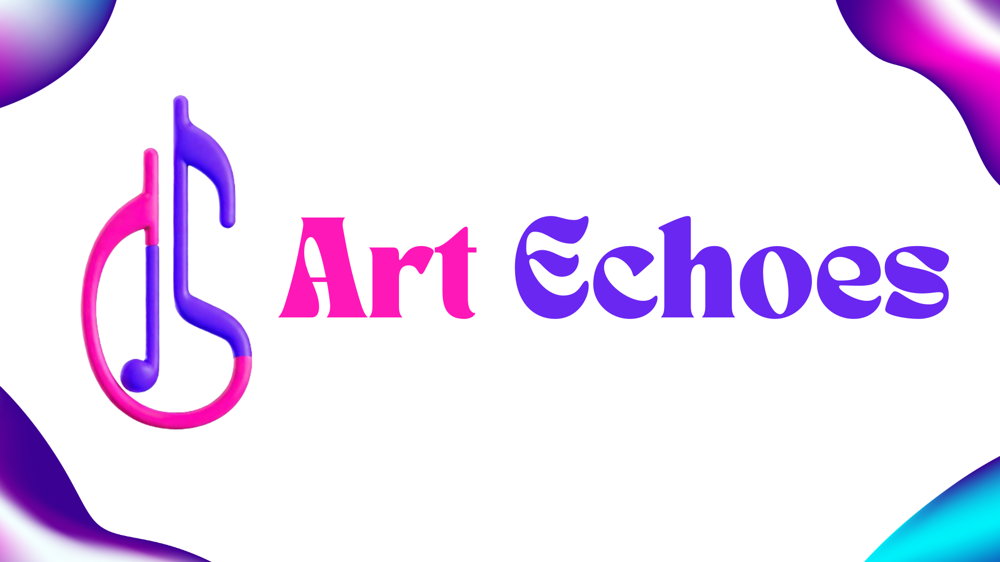

# Art Echoes - Krita Plugin

Art Echoes is a Krita plugin developed for the BeaverHacks Winter2024 Hackathon. It converts your brush strokes into musical compositions, creating a unique auditory experience based on your artwork. The generated music is saved in the MIDI format as "sound_out.mid".

## Features

- Convert brush strokes to music.
- Generate MIDI files based on your artwork.
- Utilizes the midiutil and mingus libraries for music generation.

## Installation

1. Clone this repository or download the source code.
2. Open Krita.
3. Navigate to `Settings > Manage Resources > Open Resource Folder`.
4. Within the `pykrita` directory, unzip all repository contents.
5. Restart Krita.

## Usage

1. After installation, on Krita startup, a small pop-up belonging to Krita should appear. This can be ignored.
2. Go to `Tools > Scripts` and run `Art Echoes` to open the pre-defined 1000 x 1000 px frame.
2. Use your brush strokes as you normally would.
3. Once done, close the small pop-up to convert your artwork into music.
4. A MIDI file named `sound_out.mid` will be generated in the Krita resource folder from step 3 of the installation process.

## Dependencies

- [Krita](https://krita.org/): An open-source painting software.
- [midiutil](https://pypi.org/project/MIDIUtil/): A Python library for generating MIDI files.
- [mingus](https://pypi.org/project/mingus/): A Python library for music theory and composition.

## About

This project was developed for the BeaverHacks Winter2024 Hackathon by ArtofBugs (GitHub), Kevin Ly (GitHub), BaronViper (GitHub).

## Disclaimer

This plugin is created for educational and entertainment purposes only. The quality and accuracy of the generated music may vary depending on the input artwork and parameters used.

Some code taken from posts by [AkiR](https://krita-artists.org/u/akir/summary) on [krita-artists.org] as noted in code comments.
